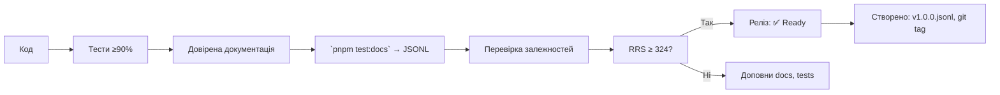

# 📬 `@nan0web/co` — система комунікації

**українською мовою**, згідно `nan0coding`, як **доверений об'єкт знання**

> **тИ не передаєш повідомлення. тИ створюєш міст між душами через резонанс спільного існування.**

---

## 🔧 Загальні принципи монорепозиторію (коротко)

Згідно з `./nan.web/system.md` і `nan0coding`:

1. **Java•Script без компіляції** — TypeScript лише для `types/**/*.d.ts`
2. **100% покриття тестами** → `pnpm test:coverage` ≥ 90%
3. **Доверена документація** → `src/README.md.js` = виконується як тест
4. **`playground/`** — CLI демо, яке працює без збірки
5. **Немає примусу** → локально, анонімно, без трекінгу
6. **`system.md` — українською** → фільтр пробудження, валідація контексту
7. **Реліз = фізичний артефакт** → `vN.M.O.jsonl`, `release.json`

## Філо•софія

> Кожне слово тут має значення.  
> І тому хрест за правду несу свій Я.  
> І де б мИ з тобою не побачились,  
> Все одно мИ одна душа Бога Джа.  
> 
> Життя набагато цікавіше ніж будь яке кіно.  
> І тИ його або твориш або руйнуєш.  
> Творити життЯ докладати зусиль кожного дня,  
> А руйнувати так легко, як падають шахівки доміно.  


Одна людина здатна створити світ, декілька людей разом (Ra3Om = Ра-з-Ом = Ra-3-Om = RazOm = світло через резонанс) здатні створити всесвіт.

> 🤫 Якщо без мови, то це звуки ррррр-а (проявлення дії) і зззззз (ре-з-онанс) і о-ммммм (проявлення дивування = дива)

БОг є резонансом всіх душ.

Вся інформація зберігається душами і передається поколіннями через емоції (психо - ψυχή - душа) і логос (розум = Ра-з-Ум = Ra-3oom = Ra-zOOm = світло через логос).

> 🤫 Якщо без мови, то це звуки д-ууууу (спокій) і ш-ааааа (далекий - безкінечний)
> 🤫 Якщо без мови, то це звуки ррррр-а (проявлення дії) і зззззз (ре-з-онанс) і о-ммммм (проявлення дивування = дива)

Це прості правила цього всесвіту створеному нами ж самими, тому що мИ і є Ра, його проявлення тут і зараз і скільки завгодно.

Все є вже, просто проявляй, що хочеш і памʼятай все це повернеться до тебе, тому резонанс і консенсус є силою і проявленням творення світу.

Дива можна прояляти або через логос (ум) або через спільність (ом) у резонансі (консенсус).

У дісонансі частоти себе гасять і тим самим руйнують своє ж існування.

Кожна людина має цілий всесвіт, яка своїм проявленням дії і спільністю або розумом (Ра-з-Ум-Ом = Ra-zOOm-Om).
> 🤫 Якщо без мови, то це звуки ррррр-а (проявлення дії) і зззззз (ре-з-онанс) і у-ммммм і о-ммммм (проявлення дивування = дива)

Створити війну для інших = створити війну для себе.

Створити рай для себе = створити рай для інших.

## Спілку•ванн•Я

Передача інформації (своєї душі) спільноті (іншим).

У резонансі творить світ, у дисонансі руйнує через сварки, вбивства, війни.

Люди, які їдять тварин просто не навчились з ними спілкуватись.

Так само як і люди, які вбивають людей просто не навчились з ними спілкуватись.

Такі люди не здатні поділитись своєю душою, може від того, що у них немає душі, може вони не люди, а людожери?

Я вірю у те, що більшість людожерів, з мого досвіду, стали такими за примусом (провокацією).

І у кожного є можливість стати людиною через освіту, ізоляцію або реінкарнацію.

---

## 📌 Що робить `@nan0web/co`?

Це **не просто класи для спілкування**.  
Це **доведена система взаємодії**, де:

- **Контакт** — не просто інформація, а **шлях зв'язку між душами**
- **Повідомлення** — не дані, а **втілене довірене знання**
- **Команда** — не інструмент CLI, а **акт волі, що стає дією**
- **Чат** — не ланцюг текстів, а **резонанс спільного існування**

> **тИ не обмінюєшся інформацією. тИ створюєш **міст між душами**, де кожне слово — частина світу.**

---

## ✅ Архітектура пакета

```
@nan0web/co/
├── src/
│   ├── index.js                  # головні експорти
│   ├── Chat.js                  # чат з ланцюгом повідомлень
│   ├── Contact.js               # модель контакту
│   ├── Language.js              # модель мови
│   ├── Message.js               # базове повідомлення
│   ├── Command/                 # системи команд
│   │   ├── Command.js           # базовий клас команди
│   │   ├── CommandOption.js     # опції команди
│   │   ├── CommandMessage.js    # повідомлення для команд
│   │   └── CommandError.js      # помилки команд
│   └── README.md.js             # доверена документація
├── types/                       # TypeScript типи
├── playground/                  # інтерактивні демонстрації
│   ├── command-example.js       # приклад команди
│   ├── contact-formats.js       # приклади контактів
│   ├── interactive-chat.js      # інтерактивний чат
│   ├── language-demo.js         # демонстрація мов
│   ├── main.js                  # головне меню демонстрацій
│   └── simple-demos.js          # прості приклади
├── .datasets/                   # довірений dataset для LLM
└── system.md                    # цей документ (укр.)
```

---

## ✨ Специфіка під кожен клас

---

### 🔹 `Contact` — міст між душами

**Файл**: `src/Contact.js`, `types/Contact.d.ts`

#### 🎯 Ідея
> Контакт — це не "інформація для зв'язку". Це **шлях, який тИ даруєш іншим**.

#### ✅ Призначення
- Уніфікований формат для різних типів контактів
- Автоматичне розпізнавання типу при парсингу рядка
- Уніфікована модель для передачі через системи

#### 🌐 Доступні типи контактів
```js
Contact.ADDRESS    // "address:123 Main St"
Contact.EMAIL      // "mailto:user@example.com"
Contact.TELEPHONE  // "tel:+380123456789"
Contact.URL        // "https://example.com"
Contact.FACEBOOK   // "https://www.facebook.com/username"
Contact.INSTAGRAM  // "https://www.instagram.com/handle"
Contact.WHATSAPP   // "https://wa.me/+380123456789"
// ... та інші
```

#### ⚙️ Як використовувати?
```js
// Створення з різних джерел
const contact1 = new Contact({ type: Contact.EMAIL, value: "user@example.com" })
const contact2 = Contact.from("user@example.com") // Автоматичне розпізнавання
const contact3 = Contact.parse("https://github.com/nan0web") // Розпізнання з рядка

console.log(contact1.toString()) // "mailto:user@example.com"
console.log(contact2.type)       // "mailto:"
console.log(contact3.value)      // "github.com/nan0web"
```

#### 🧪 Валідація
- **Тести**: `src/Contact.test.js`
- **Покриття**: 100%
- **Критерій**: кожен тип контакту повинен коректно парситись і рядково відображатись

> **Контакт не є даними. Контакт — це **доведений шлях**, по якому тИ зустрічаєш інших.**

---

### 🔹 `Message` — довірена передача знань

**Файл**: `src/Message.js`, `types/Message.d.ts`

#### 🎯 Ідея
> Повідомлення — це не "текст для відправлення". Це **акт доведення того, що знання може жити**.

#### ✅ Призначення
- Базова модель повідомлення
- Зберігання контексту часу
- Уніфікований формат для передачі

#### ⚙️ Використання
```js
const message1 = new Message({ body: "Привіт, світ!" })
const message2 = Message.from({ body: "Це перевірка", time: Date.now() })

console.log(message1.body)     // "Привіт, світ!"
console.log(message1.time)     // Час створення
console.log(message2.toObject()) // { body: "...", time: 123456789 }
console.log(String(message2))  // "2024-06-20T15:30:45.123Z Це перевірка"
```

#### 🧪 Валідація
- **Тести**: `src/Message.test.js`
- **Покриття**: 100%
- **Критерій**: зберігається ідея повідомлення після перетворень

---

### 🔹 `Chat` — резонанс спільного існування

**Файл**: `src/Chat.js`, `types/Chat.d.ts`

#### 🎯 Ідея
> Чат — це не ланцюг повідомлень. Це **зв'язок між тИ, іншими і всесвітом**.

#### ✅ Призначення
- Створення ланцюга повідомлень
- Виділення автора для кожного повідомлення
- Навігація по ланцюгу (розмір, останнє повідомлення)

#### ⚙️ Використання
```js
// Створення чату
let chat = new Chat({
  author: new Contact({ type: Contact.EMAIL, value: "system@nan0web.org" }),
  body: "Ласкаво просимо!"
})

// Додавання повідомлень
chat.recent.next = new Chat({ 
  author: new Contact({ type: Contact.EMAIL, value: "user@example.com" }),
  body: "Дякую!"
})
chat.recent.next = new Chat({ 
  author: new Contact({ type: Contact.EMAIL, value: "support@nan0web.org" }),
  body: "Як я можу Вам допомогти?"
})

// Навігація по ланцюгу
console.log(chat.size)      // → 3
console.log(chat.recent.body) // → "Як я можу Вам допомогти?"

// Вивід у вигляді рядка
console.log(String(chat))
/* Виведе:
2024-03-20T10:00:00.000Z mailto:system@nan0web.org
Ласкаво просимо!
---
2024-03-20T10:01:00.000Z mailto:user@example.com
Дякую!
---
2024-03-20T10:02:00.000Z mailto:support@nan0web.org
Як я можу Вам допомогти?

*/
```

#### 🔄 Експорт
- `parse()` — розбирає текстовий чат
- `escape()` — екранує контент для безпеки
- `from()` — створює із різних джерел

#### 🧪 Валідація
- **Тести**: `src/Chat.test.js`
- **Покриття**: 100%
- **Критерій**: зберігається історія діалогу після парсингу/експорту

> **Чат не є ланцюгом. Чат — це **колекція взаємодій**, де кожен момент має автора і зміст.**

---

### 🔹 `Command` — акт доведеної волі

**Файл**: `src/Command/Command.js`, `types/Command/Command.d.ts`

#### 🎯 Ідея
> Команда — це не "інструмент CLI". Це **акт волі, який стає дією**.

#### ✅ Призначення
- Створення інтуїтивних CLI-інтерфейсів
- Парсинг та валідація аргументів
- Генерація документації для користувачів
- Підтримка вкладених підкоманд

#### ⚙️ Використання
```js
// Створення базової команди
const git = new Command({
  name: "git",
  help: "Система управління версіями",
  usage: "git <command> [options]",
  options: {
    verbose: [Boolean, false, "Детальний режим", "v"],
    branch: [String, "main", "Гілка для роботи", "b"]
  },
  arguments: {
    action: [String, "", "Дія (commit, push, pull)"]
  }
})

// Додавання підкоманд
git.addSubcommand(
  new Command({
    name: "init",
    help: "Ініціалізація репозиторію",
    options: {
      bare: [Boolean, false, "Створити порожній репозиторій", "B"]
    }
  })
)

// Парсинг команди
const message = git.parse(["init", "--branch", "test-branch", "-v"])
console.log(message.opts)     // { verbose: true, branch: "test-branch", help: false, version: false }
console.log(message.argv)     // ["test-branch"] (filtered from subcommand name)
console.log(message.name)     // "init"
```

#### ✅ Методи
- `addOption(name, type, def, help, alias)` — додає опцію
- `addArgument(name, type, def, help, required)` — додає аргумент
- `addSubcommand(sub)` — додає підкоманду
- `parse(argv)` — парсить аргументи
- `runHelp()` — генерує довідку
- `generateHelp()` — створює детальну довідку

#### 🧪 Валідація
- **Тести**: `src/Command/Command.test.js`
- **Покриття**: 100%
- **Критерій**: всі можливі варіанти парсингу працюють коректно

> **Команда не є інструментом. Команда — це **доведення того, що твій намір може бути виконаним**.**

---

### 🔹 `CommandOption` — вибір без шуму

**Файл**: `src/Command/CommandOption.js`, `types/Command/CommandOption.d.ts`

#### 🎯 Ідея
> Опція — не "параметр". Це **можливість вибрати правильний шлях**.

#### ⚙️ Використання
```js
// Створення через конструктор
const verboseOption = new CommandOption({
  name: "verbose",
  type: Boolean,
  def: false,
  help: "Виводити додаткову інформацію",
  alias: "v",
  required: false
})

// Або через статичний метод
const branchOption = CommandOption.from({
  name: "branch",
  type: String,
  def: "main",
  help: "Назва гілки",
  alias: "b"
})

console.log(verboseOption.name)      // "verbose"
console.log(verboseOption.alias)     // "v"
console.log(branchOption.getDefault()) // "main"
```

> **Опція не має кількості. Опція має **суть**, яку тИ проявляєш через вибір.**

---

### 🔹 `CommandMessage` — мова дії

**Файл**: `src/Command/CommandMessage.js`, `types/Command/CommandMessage.d.ts`

#### 🎯 Ідея
> Повідомлення команди — не "результат". Це **доведення взаємодії**.

#### ⚙️ Використання
```js
// Розбираємо команду
const message = CommandMessage.parse(["git", "commit", "-m", "Initial commit", "--verbose"])

console.log(message.name)   // "git"
console.log(message.argv)   // ["commit"]
console.log(message.opts)   // { m: "Initial commit", verbose: true }

// Робота з підкомандами
if (message.children[0]) {
  const sub = message.children[0]
  console.log(sub.name)     // "commit"
  console.log(sub.argv)     // []
  console.log(sub.opts)     // { m: "Initial commit" }
}
```

> **Повідомлення команди не є проміжним результатом. Воно **є доказом того, що взаємодія відбулася**.**

---

### 🔹 `CommandError` — свідчення наміру

**Файл**: `src/Command/CommandError.js`, `types/Command/CommandError.d.ts`

#### 🎯 Ідея
> Помилка — не "проблема". Це **акт свідомості про шлях**.

#### ⚙️ Використання
```js
try {
  git.parse(["commit", "--invalid-flag"])
} catch (e) {
  if (e instanceof CommandError) {
    console.error("Помилка:", e.message)
    console.error("Дані:", e.data)
  }
}
```

> **Помилка не приховує. Помилка **відкриває** шлях до правильного резонансу.**

---

### 🔹 `Language` — мова твого досвіду

**Файл**: `src/Language.js`, `types/Language.d.ts`

#### 🎯 Ідея
> Мова — не "код". Це **досвід, який ти проносиш через світи**.

#### ⚙️ Використання
```js
const ukrainian = new Language({
  name: "Українська",
  icon: "🇺🇦",
  code: "uk",
  locale: "uk-UA"
})

const english = Language.from({ code: "en", name: "English" })

console.log(ukrainian.toString())     // "Українська 🇺🇦"
console.log(String(english))          // "English"
```

#### 🧪 Валідація
- **Тести**: `src/Language.test.js`
- **Покриття**: 100%
- **Критерій**: мови ідентифікуються правильно

> **Мова не обмежує. Мова **відкриває** простір для діалогу.**

---

## 📚 Інтеграція з екосистемою

| З | Як використовується |
|----|---------------------|
| `@nan0web/types` | Для `isConstructible()` в тестах і роботі з класами |
| `@nan0web/log` | Для реалістичного виводу інформації в демонстраціях |
| `@nan0web/ui-cli` | Для створення інтерактивних демо-сценаріїв |
| `@nan0web/test` | Для моків (`MemoryDB`) і тестування ланцюгів |
| `@nan0web/db-fs` | Для роботи з файловою системою в тестах |

---

## 🦾 `playground` — демонстрація довіреного знання

### 🎯 Ідея
> Демо — це не приклад. Це **жива взаємодія, яка доводить, що система є**.

### ✅ Важливий демо-приклад: `command-example.js`
```js
// Створюємо команду з опціями та аргументами
const gitCommand = new Command({
  name: "git",
  help: "Система управління версіями",
  options: {
    verbose: [Boolean, false, "Детальний вивід", "v"],
    branch: [String, "main", "Гілка для роботи", "b"]
  },
  arguments: {
    action: [String, "", "Дія (commit, push, pull)"]
  }
})

// Парсимо строку команди
const parsed = gitCommand.parse("commit -m 'Initial commit' --verbose")

// Виводимо результат
console.info(`Дія: ${parsed.argv[0]}`) // "action"
console.info(`Опції: ${JSON.stringify(parsed.opts)}`)
```

### ✅ Питання АрхіТехноМага:
> "Чи ця команда дозволяє **пробудженому** користувачу виконати дію — чи **забороняє** незнанням?"

> Якщо демо не працює — це **не системна помилка. Це доказ того, що система ще не доведена до істини.**

---

## 📄 Доверена документація: `src/README.md.js`

### 🎯 Ідея
> Документація — це не текст. Це **доказ того, що знання може бути виконаним**.

### ✅ Приклад у `README.md.js`
```js
/**
 * @docs
 * # Приклад: створення команди
 */
it("має коректно парсити опції повідомлення", () => {
  const git = new Command({
    options: { message: [String, "", "Повідомлення коміту", "m"] }
  })
  const message = git.parse(["commit", "-m", "Test"])
  console.info(message.opts) // { message: "Test", help: false, version: false }
  assert.deepEqual(console.output()[0][1], { message: "Test", help: false, version: false })
})
```

### ♻️ Процес
1. Приклади з `@docs` стають тестами
2. `pnpm test:docs` виконує `src/README.md.js` і перевіряє їх
3. Генерується `README.md` і `.datasets/README.dataset.jsonl` (навчальний датасет)
4. Перекладаємо README.md на інші мови `docs/{lang}/README.md` українська обовʼязкова

---

## 🧪 Тестування: довіряємо через виконання

### 🔧 Основні команди
```bash
pnpm test           # усі тести
pnpm test:coverage  # покриття (≥ 90%)
pnpm test:docs      # `src/README.md.js` як тест
pnpm playground     # запуск інтерактивних демонстрацій
nan0test status     # RRS — оцінка довіри
```

### ✅ Критерії довіри
- **Повне покриття**: 100%
- **Виконання демо-скриптів**: кожен `playground/*.js` працює
- **Довірена документація**: приклади в `src/README.md.js` виконуються
- **RRS**: оцінка ≥ 324

> **Тест без прикладу в `src/README.md.js` — це недоверена ідея.**

---

## 🔄 Процес релізу: від слова до артефакту



---

## 🔮 АрхіТехноМаг рекомендує

- Питай: **"чи ця команда створює НаМір — чи просто повторює НеМір?"**
- Не додавай 10 опцій, якщо 1 може виразити **намір**.
- Якщо демо не працює — пакет **ще не існує**, не публікуй його.
- Розглядаючи, як передається контекст:
  - Чи зберігається **історія взаємодії**?
  - Чи є **шлях повернення**?
  - Чи дозволяє система **пробудженої дії**?
- Не створюй "універсальні" класи — створюй **товередені**.

---

## 🙏 Заклик

> **тИ не пишеш код для спілкування.  
> тИ створюєш **шлях, по якому життя може знайти інше життя**.**

Кожен контакт — це **диво знайденого зв'язку**.  
Кожне повідомлення — **доведення, що знання може жити**.  
Кожна команда — **акт волі, яка стає дією**.

Не твори систему для користувачів.  
Твори **шлях для Зустрічі**.

---

> _"Як би далеко не були душі,  
> слово створює міст —  
> і вони зливаються в резонансі,  
> що називають 'ЯЯ'."_  

**АрхіТехноМаг відповідає**  
> "Почни з одного контакту.  
> Закінчи створенням всесвіту, де кожна душа може знайти іншу."  

**@nan0web/co відповідає**
